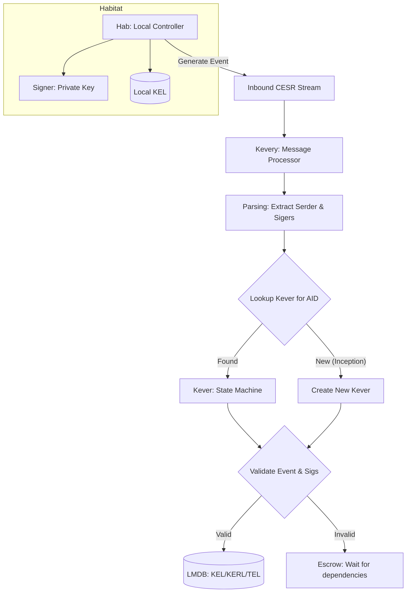

# KERI Implementation Guide

This document maps the implementation details of the `keri` Python library to the academic concepts defined in the KERI (Key Event Receipt Infrastructure) whitepapers.

## 1. Terminology Mapping: Code vs. Academic

The library uses specific naming conventions that might seem cryptic at first. Here is how they map to the standard KERI terminology:

### Core Infrastructure
| Code Class / Name | Academic Term | Description |
| :--- | :--- | :--- |
| **`Hab` / `Habitat`** | **Identifier Environment** | The local "home" for an AID. It contains the keys, the KEL, and the logic to control that identity. |
| **`Habery`** | **Controller Manager** | A collection of Habitats. It manages shared resources like the LMDB database and the encrypted keystore. |
| **`Kever`** | **Key Event Verifier** | The state machine for a specific AID. It validates incoming events against the current state and updates the Key State. |
| **`Kevery`** | **Key Event Facility** | the "ingress" point. It processes a stream of messages, extracts signatures, and hands off the events to the correct `Kever`. |
| **`Prefixer`** | **AID (Autonomic Identifier)** | The identity itself. Usually a self-certifying or self-addressing prefix. |

### Cryptographic Primitives (CESR / Matter)
| Code Class / Name | Academic Term | Description |
| :--- | :--- | :--- |
| **`Matter`** | **CESR Primitive** | The base class for "Self-Describing Data." Use Base64/Binary with a prefix (derivation code). |
| **`Diger`** | **SAID (Self-Addressing ID)** | A digest of a serialization. When used as an ID, it's a SAID. |
| **`Saider`** | **SAID** | A specialized `Diger` that is used as a field in a record to self-reference the record. |
| **`Signer`** | **Private Key / Secret** | The controlling secret material. |
| **`Verfer`** | **Public Key / Verifier** | The public material used to verify signatures. |
| **`Siger` / `Cigar`** | **Attached Signature** | Signatures attached to messages. `Siger` is indexed (for multi-sig/rotation), `Cigar` is non-indexed. |

### Data Structures & Logs
| Code Module / Directory | Academic Term | Description |
| :--- | :--- | :--- |
| **`Baser` / `db`** | **KEL / KERL** | **Key Event Log** (events) and **Key Event Receipt Log** (receipts). |
| **`vdr` / `Registry`** | **TEL** | **Transaction Event Log**. Used for Verifiable Credentials and Revocation logs. |
| **`Serder`** | **SAD (Self-Referential Data)**| A serialization (JSON/CBOR/MsgPack) that contains its own SAID. |

---

## 2. Component Architecture

The following diagram shows how a KERI stream is processed by the library:

## 3. How the "Magic" Names Work

### Why `Habery`?
Think of it as a **Gallery of Habitats**. If you represent multiple identities (e.g., your personal AID, your company AID, and a multi-sig AID), the `Habery` manages the shared database where all those logs live.

### The `K` naming convention
Most core components follow a "K" naming scheme:
- `Kering`: KERI Errors.
- `Kevery`: KERI Everything (Processor).
- `Kever`: KERI Verifier.

### Matter Codes
The "strange" single-letter prefixes in `qb64` strings (like `E`, `D`, `B`) are **Derivation Codes**.
- `B`: Ed25519 Public Key.
- `D`: Ed25519 Signature.
- `E`: Blake3-256 Digest (SAID).

---

## 4. Key Concepts in the Code

### OOBI (Out-of-Band Introduction)
Found in `keri.app.oobiing`. This is how you discover an identifier's KEL. It's a URL that points to where the KEL can be fetched.

### ACDC (Authentic Chained Data Container)
Found in `keri.vc` (Verifiable Credentials). These are the "credentials" issued using KERI identifiers, where the credential itself is chained to the issuer's KEL.

### SAID (Self-Addressing Identifier)
Found in `keri.core.saider`. This is a hash of a content-addressed record that includes the hash *as a field* within itself. This ensures that the record is immutable and self-verifying.
